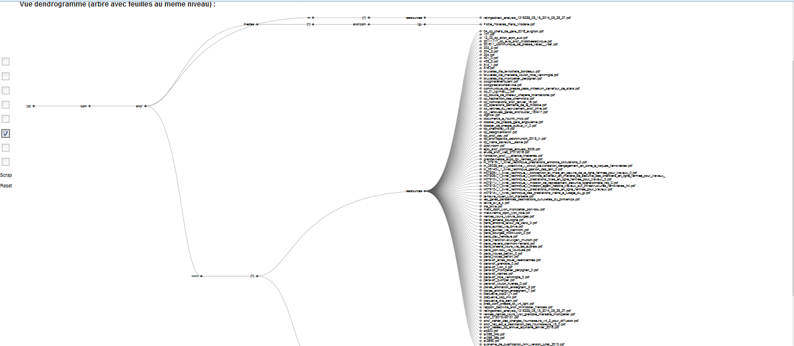

// GNU General Public License, version 3.

* GoogleScraper is a Greasemonkey script helping to scrap and format results from Google search and Google vidéo tab search.
* It's fonctionnal with Firefox 53.x and www.google.fr ; not tested with others, but you can change header to include your country page.
* // Just disable it when you don't search specific things ; there are bugs with # and tab switch and so on ... 

# FEATURES :
* A special toolbox is added on the left of the Google page and you can change the results display into several views.
* In order :
1. Compact View 			-> keep the results in the same order and display (rank, title, url, text)
2. Date View 				-> display (rank, date if present, title, url) sorted by date
3. FQDN View 				-> display (urls) sorted by (reversed domain ie : tld.domain.sub[..], path+search+hash)
4. FQDN Sorted View 		-> display (rank,urls,title) sorted by (reversed domain ie : tld.domain.sub[..], path+search+hash)
5. Bubble Graph 			-> display Bubbles with keywords frequencies filtered by (Zipf law for english(128 first words non relevants) ; wordlist for french, len > 2, F > 1)
6. Dendrogramme Graph 		-> Tree with url join on domain and folders with leaves in same y position
7. Collapsible Tree Graph 	-> Tree with url join on domain and folders
8. Force Layout Graph 		-> (Bug with fix/unfix) Tree with url join on domain and folders with forces between nodes, collapsible & zoom 
9. "Scrap" : Wait until it scrap the results by 100 with the keyword you entered in the Google search box (1 to 7/8 pages refresh with 2 to 4 second waiting between each) and display the result in the page. Use then the différent checkbox to format results
10. "Reset" : cancel the scrap on next refresh

* Only "Scrap" will use external page ressource with GET ;
* The page search is also modified (display by 100, filter=0) ... will improve parameters parsing soon;
* Google proxy on urls is removed ; (when you click on results)
* cnso and so on are also removed
* NID cookie is http-only so I think can't be removed ;
* Well ... it doesn't rise captchas when I use it ...

# INSTALL :
* Don't forget to logout from your Google account before using it ;
**ctrl + shift + A** in firefox -> Greasemonkey user scripts -> drag-and-drop the script on it;
* Enjoy !

# SCREENS

# CODE OVERVIEW :

* Hell ... just developped it quick ;
* "Parametre" object is used to group parameters retrievial and parsing ;
* "Recherche" object is used when you click the scrap button ;
* "GooglePage" object is used to change the google page (it remove useless things, and so on.) ;
